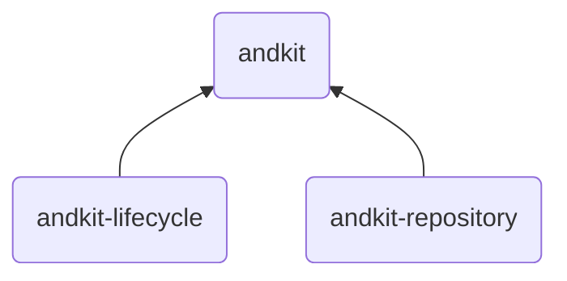
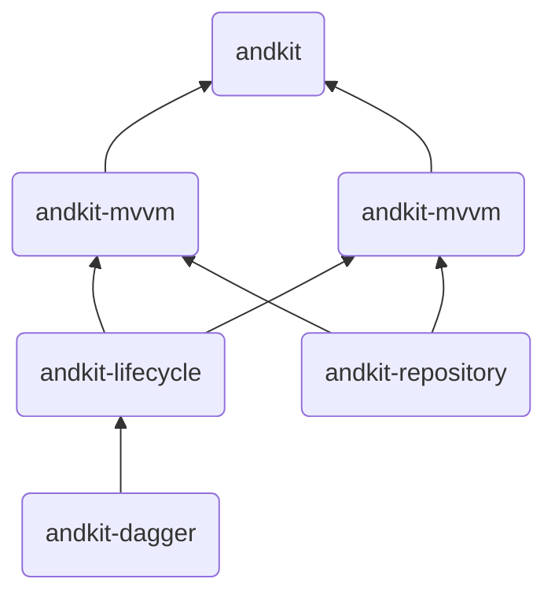

# Andkit

## 简介

Andkit是一个比较灵活的Android组件化方案，是我在学习和工作中的积累和一次尝试。目前Andkit简单的将应用分为三层

### Andkit 的基本架构图



如上图所展示，Andkit框架最核心由这三部分组成，它们的作用分别是:

- andkit-lifecycle：定义框架之中Activity和Fragment的必要接口（用于实现依赖注入、EventBus事件订阅等），并且将Activity、Fragment和Application在生命周期中的一些关键回调事件进行封装处理。
- andkit-repository：封装仓储层的实现，如OkHttp、Retrofit、Room、Gson等等与数据的操作相关的组件的配置和提供，并且暴露方法，可通过Application直接获取全局统一的仓储层对象实例。
- andkit：统筹lifecycle和repository层，管理各个组件间依赖注入的完成、管理不同模块的AbsApplicationWrapper[代理Application，组件内没有真正的Application，具体必须要在Application生命周期中要调用的方法，可在AbsApplicationWrapper对应生命周期中完成，并且通过@Kiss注解添加到主模块的Application上]。

事实上，Andkit框架只依赖以上三个库就可以完成组件化的工作，但是由于IActivity和IFragment中只提供了三个方法：

```kotlin
interface IActivity {
    fun useFragment() = false
    fun useEventBus() = false
    fun injectable() = false
}
```

```kotlin
interface IFragment {
    fun initData(savedInstanceState: Bundle?){}
    fun useEventBus()=false
    fun injectable()=false
}
```

所以无论是Activity还是Fragment对于应用的模式都没有要求，无论你是想用MVP还是MVVM都可以，只要按照要求实现IActivity和IFragment接口中的方法就行了。

因此，andkit框架亦实现了mvvm和mvp的基础框架

所以完整版的框架结构图如下:



andkit作为整个应用的顶级统筹者，它不关心应用的底层是MVP还是MVVM,所以组件化时候，A模块是MVVM，那么可以直接A模块依赖andkit-mvvm，对应的Activity或者Fragment继承自BaseActivity即可以按照MVVM的模式开发，同理B模块如果按照MVP模式开发，那么B模块依赖andkit-mvp即可以按照MVP模式开发。如果说andkit-mvvm或者andkit-mvp设计不够合理或者不满足业务需求，可以自己依赖andkit-lifecycle和andkit-repository实现自己的框架即可。

## 工程目录结构


整个工程分为三个文件夹，即三个部分：

- andkit-libs: andkit框架的所有组件，其他工程主要依赖本框架的子组件即可实现对应模块开发。
- examples:以WanAndroid相关Api开发的demoAPP，组件之间通过ARoute实现页面路由跳转。
- flutter：flutter 模块，提供了两个页面(关于和妹子图片)，flutter模块子模块被wa-mine模块调用。
